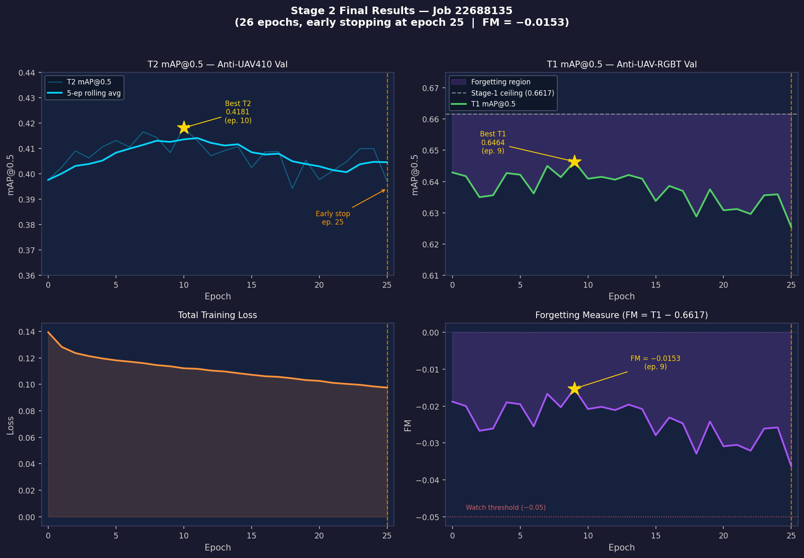

# UvA MSc Information Studies Thesis — UAV Detection with Continual Learning

**Author:** Khac Duc Giang Nguyen  
**Institution:** University of Amsterdam, MSc Information Studies

## Overview

This repository contains all code, SLURM job scripts, dataset wrappers, and progress logs
for my MSc thesis on cross-domain continual learning for UAV detection.

The core idea: train a dual-stream IR+motion detector (YOLOMG) on a large labelled dataset,
then transfer it to a new domain without catastrophic forgetting, and measure how much it
forgets using a Forgetting Measure (FM = mAP_T1_after_T2 − mAP_T1_after_T1).

---

## Three-Stage Curriculum

| Stage | Task | Dataset | Status |
|-------|------|---------|--------|
| 1 | Full supervision — establish T1 mAP ceiling | Anti-UAV-RGBT (149K/62K frames) | ✅ Done — mAP@0.5 = 0.6617 |
| 2 | Teacher-Student UDA — cross-domain transfer | Anti-UAV410 (214K/95K frames) | ✅ Done — mAP@0.5 = 0.4181, FM = −0.0153 |
| 3 | Continual fine-tuning (Scale-Stratified Herding) | CST | 🔜 Planned |

---

## Model: YOLOMG

Dual-input YOLOv5-based detector (Guo et al., 2025):

- `img1`: IR appearance frame
- `img2`: Motion mask via Concat3 layer
- 318 layers, ~3M parameters, 640×640 input

At Stages 1 and 2, `img2 = zeros` (datasets have no precomputed motion masks).  
Model config: `YOLOMG-main/models/dual_uav2.yaml`

---

## Stage 1 Results

| Metric | Value |
|--------|-------|
| mAP@0.5 | **0.6617** |
| mAP@0.5:0.95 | **0.2900** |
| Best epoch | 54 / 99 |
| Training time | ~40 h (4×A100, Snellius HPC) |

mAP@0.5:0.95 is lower than mAP@0.5, which is expected for small UAV targets —
strict IoU thresholds are hard to satisfy when objects are only a few pixels wide.

---

## Stage 2 Results

Stage 2 implements Teacher-Student Unsupervised Domain Adaptation (UDA) on Anti-UAV410.
The student is fine-tuned on Anti-UAV410 ground-truth annotations while a frozen copy of
the Stage 1 model (teacher) provides a knowledge distillation signal to prevent forgetting:

```
L_total = L_det + λ_kd × L_kd
```

where `L_kd` is the MSE between student and teacher raw prediction grids at scales P3/P4/P5,
computed before NMS. `λ_kd = 1.0`.

**Job:** 22688135 — 4×A100, node gcn54, 72 h limit  
**Completed:** 14 May 2026 — early stopping triggered at epoch 25 (patience = 15, best T2 at epoch 10)

| Metric | Value |
|--------|-------|
| Best T2 mAP@0.5 (Anti-UAV410) | **0.4181** (epoch 10) |
| Best T1 mAP@0.5 after T2 (Anti-UAV-RGBT) | **0.6464** (epoch 9) |
| Forgetting Measure (FM) | **−0.0153** |
| Total epochs | 26 (early stopping) |
| Wall time | ~22 h (4×A100) |

The FM of −0.0153 means the model retained 98.5% of its original Anti-UAV-RGBT performance
after full Stage 2 training on Anti-UAV410. The KD loss at λ=1.0 effectively prevented
catastrophic forgetting (unconstrained fine-tuning typically causes 20–40 pp collapse).

Selected epoch-level results:

| Epoch | Loss | T2 mAP@0.5 | T1 mAP@0.5 | FM |
|-------|------|------------|------------|-----|
| 0  | 0.1393 | 0.3976 | 0.6429 | −0.019 |
| 5  | 0.1181 | 0.4131 | 0.6422 | −0.020 |
| 7  | 0.1160 | 0.4165 | 0.6450 | −0.017 |
| **10** | **0.1121** | **0.4181** | 0.6409 | −0.021 |
| 15 | 0.1072 | 0.4024 | 0.6338 | −0.028 |
| 20 | 0.1026 | 0.3977 | 0.6308 | −0.033 |
| 25 | 0.0975 | 0.3969 | 0.6254 | −0.036 |



---

## Repository Structure

```
YOLOMG-main/                  YOLOMG model source (Guo et al., 2025)
src/
  datasets/                   Dataset wrappers (Anti-UAV-RGBT, ARD100, CST, Anti-UAV410)
  train_stage1.py             Stage 1 DDP training (4×A100)
  train_stage2.py             Stage 2 single-GPU training
  train_stage2_ddp.py         Stage 2 DDP training (4×A100)
  eval_stage1.py              Standalone eval — proper 10-threshold mAP@0.5:0.95
  run_stage1_ddp.sh           SLURM job: Stage 1
  run_eval_stage1.sh          SLURM job: standalone eval
  run_stage2_ddp.sh           SLURM job: Stage 2 DDP (72 h, 4×A100)
  meeting_2.tex               Supervisor meeting log — Week 17–18
  meeting_3.tex               Supervisor meeting log — Week 19–20 (Stage 2 results)
logs/                         SLURM output logs (all jobs, weeks 17–20)
docs/
  stage2_progress.png         Stage 2 learning curves (T2 mAP, T1 mAP, loss, FM)
```

---

## Installation (Snellius HPC)

```bash
conda create -n uav_master python=3.9
conda activate uav_master
pip install torch==2.0.1 torchvision==0.15.2 --index-url https://download.pytorch.org/whl/cu118
pip install opencv-python-headless numpy scipy matplotlib pyyaml tqdm
```

---

## Running

### Stage 1
```bash
sbatch src/run_stage1_ddp.sh
sbatch src/run_eval_stage1.sh   # after training — computes real mAP@0.5:0.95
```

### Stage 2
```bash
sbatch src/run_stage2_ddp.sh
# Reads:  runs/stage1/antiuav_rgbt14/weights/best.pt
# Writes: runs/stage2/antiuav410*/weights/best.pt
#         runs/stage2/antiuav410*/stage2_t2_mAP.txt
#         runs/stage2/antiuav410*/stage2_t1_mAP.txt
```

---

## Key Implementation Notes

**DDP:** `torchrun --standalone --nproc_per_node=4`, NCCL backend, 2 h timeout.
Always use the absolute path to `torchrun` in SLURM scripts — the conda environment
PATH is not inherited by the job scheduler.

**Distributed validation:** all 4 ranks validate in parallel via `DistributedSampler` +
`all_gather_object`, cutting val time from ~40 min to ~10 min per epoch.

**ap_per_class (YOLOMG-specific):** returns 7 values (not 5 like standard YOLOv5) and
requires a 2D `correct` array of shape `(N, num_iou_thresholds)`. Training uses `(N,1)`,
standalone eval uses `(N,10)` for accurate mAP@0.5:0.95.

**Workers:** use `persistent_workers=False`. With `True`, VideoCapture workers accumulate
CPU RAM over long jobs and trigger OOM. Stage 1 job 22522864 was killed at epoch 83
for this reason; best checkpoint was already saved at epoch 54.

**Teacher-Student KD:** the teacher model runs as a plain `nn.Module` (not DDP-wrapped),
frozen under `torch.no_grad()`. Student uses `find_unused_parameters=True` because
`img2=zeros` skips the motion branch (backbone1), leaving those parameters without
gradients.

**Dataset copying:** copy mp4 files to GPFS scratch before training (~73 s for 5.1 GB).
Do NOT pre-extract JPEG frames — same speed as VideoCapture but costs 4 h to copy 211K files.

**SLURM time limits:** Stage 1 requires ~43 h wall time (50 epochs × ~51 min/epoch at
batch 16 on 4×A100). Set `--time=72:00:00` to be safe.
